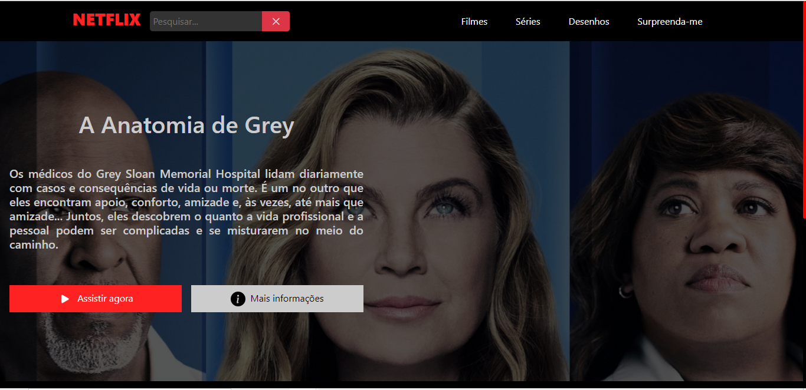
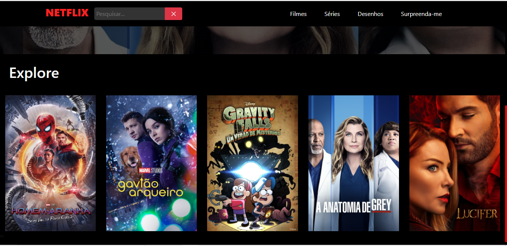

<h1>Recriando a Netflix</h1>
<small>Um projeto proposto pela Digital Innovation One</small>

<h4>Alguns diferenciais feitos no projeto incluem:</h4>
<ul>
    <li>Interface construída em React</li>
    <li>Exibir a série no cartaz ao clicar sobre ela</li>
    <li>Filtros de Filmes, Séries e Desenhos</li>
    <li>Uma barra de pesquisa que exibe os resultados da busca</li>
    <li>Um botão de surpreenda-me, que exibe uma série aleatória</li>
    <li>Exibir informações da série ao clicar em "mais informações"</li>
    <li>Exibir o trailer ao clicar em "Assisstr agora"</li>
</ul>

<h1>Screenshots:</h1>

